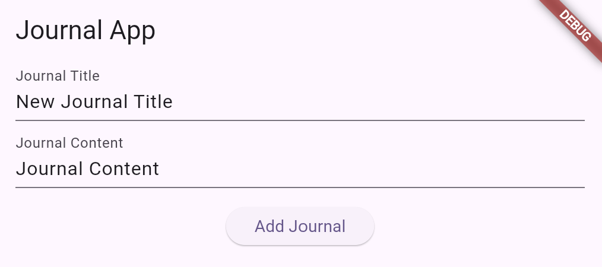
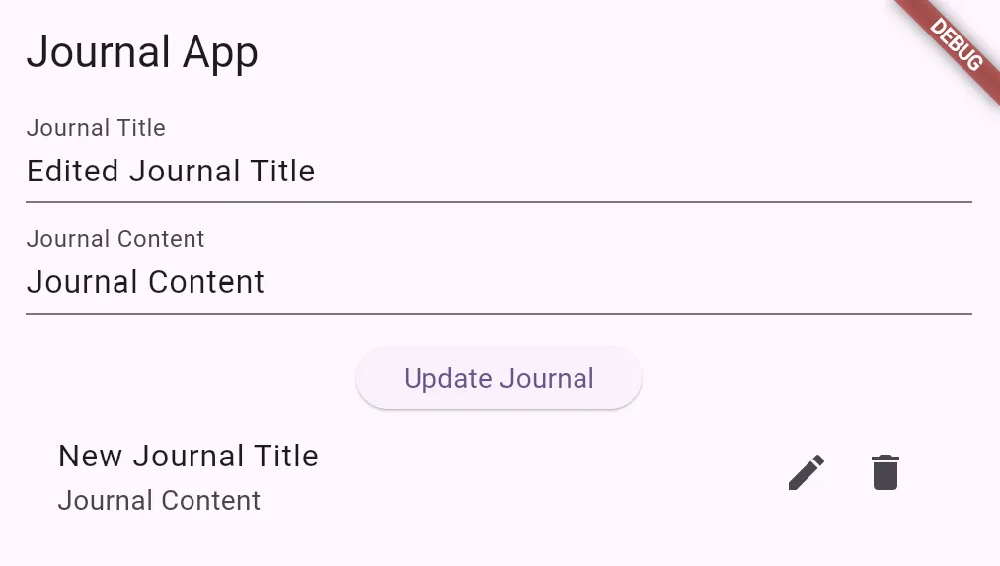
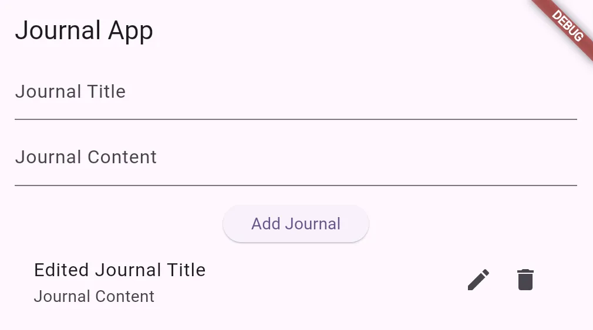

# Lecture 6 Individual Exercise

This document is also available through the following sources: 

- GitLab: [https://gitlab.socs.uoguelph.ca/ffawad/cis4030-exercise](https://gitlab.socs.uoguelph.ca/ffawad/cis4030-exercise)
- Notion: [https://hollow-sunshine-a6c.notion.site/Lecture-6-Individual-Exercise-1890739a1c5f808fb467f30822677822](https://www.notion.so/Lecture-6-Individual-Exercise-1890739a1c5f808fb467f30822677822?pvs=21)

## Overview

In this exercise, you will be utilizing a local database to persist data within a Flutter application. The goal of this exercise is to create an application that functions like a Journal, meeting the requirements briefly illustrated below:

- A user can add, edit, and delete journal entries
- Journal entries are stored and retained across application sessions

## Learning Goals

- Integrating and working with local databases in Flutter
- Understanding how to design and use data models in Flutter
- Implementing CRUD (`CREATE`, `READ`, `UPDATE`, `DELETE`) operations with a local database

## Documentation

- Cookbook for SQLite with Flutter: [https://docs.flutter.dev/cookbook/persistence/sqlite](https://docs.flutter.dev/cookbook/persistence/sqlite)
- SQLite plugin for Flutter: [https://pub.dev/packages/sqflite](https://pub.dev/packages/sqflite)
- Factory constructors in Flutter: [https://dart.dev/language/constructors#factory-constructors](https://dart.dev/language/constructors#factory-constructors)

## Setup

Choose one of the Express or Manual installation methods

### **Express Installation:**

1. Clone or download the source code from the GitLab repository: [https://gitlab.socs.uoguelph.ca/ffawad/cis4030-exercise](https://gitlab.socs.uoguelph.ca/ffawad/cis4030-exercise)
    - NOTE: You will have to be logged into your school GitLab account
2. Navigate to the project directory and install dependencies with `flutter pub get`

### **Manual Installation:**

If you run into any sort of environment issues, try resolving them or manually installing the application with the instructions below:

1. Create a new Flutter application with `flutter create <name>`
2. Navigate to project directory and install dependencies with `flutter pub add sqflite path path_provider sqflite_common_ffi_web`
3. Install the `sqflite` web binaries with `dart run sqflite_common_ffi_web:setup` 
    - NOTE: This step is required for web emulation as the `sqflite` package doesn't support web development out of the box
4. Replace the boilerplate `lib/main.dart` file with the file on the GitLab repository: [https://gitlab.socs.uoguelph.ca/ffawad/cis4030-exercise/-/blob/main/lib/main.dart](https://gitlab.socs.uoguelph.ca/ffawad/cis4030-exercise/-/blob/main/lib/main.dart)

Once the installation is complete, you should successfully be able to run the Flutter application with `flutter run` or any other preferred method

- NOTE: The Flutter application will have compilation errors (specifically with `toMap` and `fromMap`) until some of the instructions are completed

## Project Structure

For the purpose of this exercise, the code for this application has been organized into a single file `lib/main.dart` 

- The code is structured in a way where you will work from top to bottom
- `TODO` comments are missing snippets of code that you will fill in to complete this exercise
    - A quick tip for VSCode users: A `TODO` comment is underlined with a blue squiggly line; you can view all `TODO` comments under the Problems tab with `CTRL + SHIFT + M`

## Instructions

The `TODO` comments and instructions below are guidelines that do not strictly need to be followed; You may implement the code in any way you desire as long as it meets the marking scheme

- NOTE: Your implementation should be contained in one file `lib/main.dart` and should not use any dependencies other than `sqflite`, `path`, `path_provider`, and `sqflite_common_ffi_web`

### TODO 1: Complete the `toMap` Method

This method is useful for converting a `Journal` object to a `Map` which is required for inserting journals into our database

```dart
// Converts a Journal into a map. The keys must correspond to the names of the
// columns in our database
Map<String, dynamic> toMap() {
  // TODO 1: Return a map containing `id`, `title`, and `content` keys with their respective values
}
```

### TODO 2: Complete the `fromMap` Factory Constructor

This constructor is useful for initializing a `Journal` object through a `Map` which helps parse journals returned by our database

```dart
// A factory constructor which allows us to make a Journal directly from a map
// See here for more details on factory constructors: https://dart.dev/language/constructors#factory-constructors
factory Journal.fromMap(Map<String, dynamic> map) {
  // TODO 2: Return a Journal object by mapping the provided map's keys to the Journal's properties
}
```

### TODO 3: Complete the `_initializeDatabase` Method

This method initializes our database, preparing it for future use within our application

```dart
// Initializes our database
Future<void> _initializeDatabase() async {
  // TODO 3: Open a SQLite database and create a table `journals` with columns `id`, `title`, and `content`
  // if it does not exist. The database should be assigned to the variable `_database`

  // Reloads the journals by calling `setState`
  _loadJournals();
}
```

The schema of the `journals` table is shown below:

| **`id`** | `INTEGER`, `PRIMARY KEY` |
| --- | --- |
| **`title`** | `TEXT` |
| **`content`** | `TEXT` |

### TODO 4: Complete the `_loadJournals` Method

This method loads all journal entries from our database, it is the `READ` operation for our application

```dart
// Loads all journals from our database
Future<void> _loadJournals() async {
  // TODO 4: Fetch ALL journal entries from the `journals` table in the database. The entries should be assigned 
  // to the variable `_journals`. Don't forget to call `setState` to reload the journals
}
```

### TODO 5: Complete the `_addJournal` Method

This method adds a journal entry to our database, it is the `CREATE` operation for our application

```dart
// Adds a new journal in our database
Future<void> _addJournal(String title, String content) async {
  // TODO 5: Create a new Journal object with the given title and content, insert it into the `journals` table in the database.
  // Don't forget to set the generated ID to the new Journal object, or else you will run into a bug!

  // Reloads the journals and clears filled in fields by calling `setState`
  _loadJournals();
  _clearFields();
}
```

### TODO 6: Complete the `_updateJournal` Method

This method adds a journal entry to our database, it is the `UPDATE` operation for our application

```dart
// Updates a pre-existing journal in our database
Future<void> _updateJournal(String title, String content) async {
  // If we are updating a journal, the instance variable `_editingJournal` should not be `null`
  if (_editingJournal == null) return;

  _editingJournal!.title = title;
  _editingJournal!.content = content;

  // TODO 6: Update the `journals` table in the database with the current journal's data based on its ID

  // Reloads the journals and clears filled in fields by calling `setState`
  _loadJournals();
  _clearFields();
}
```

### TODO 7: Complete the `_deleteJournal` Method

This method deletes a journal entry from our database, it is the `DELETE` operation for our application

```dart
// Deletes a journal from our database
Future<void> _deleteJournal(int id) async {
  // TODO 7: Delete a journal entry from the `journals` table in the database using the provided ID

  // Reloads the journals by calling `setState`
  _loadJournals();
}
```

### TODO 8/9: Complete the Callback Functions

These callback functions should invoke their respective CRUD operations to complete the process from the UI to the backend

```dart
...
TextField(
  controller: _textController,
  decoration: InputDecoration(labelText: 'Journal Content'),
  onSubmitted: (text) {
    // TODO 8: Retrieve the title from the text controller and add a journal entry using the title and text
  },
)
...
IconButton(
  icon: Icon(Icons.delete),
  onPressed: () {
    // TODO 9: Delete a journal entry using the ID
  },
)
...
```

## Submission

To submit your work, download the `lib/main.dart` file with your modified changes and submit it to the Dropbox on CourseLink

## Testing

For testing, see the marking scheme below and make sure your code works in all cases. Also make sure to double check that your code is cross-platform and works on both web and mobile (iOS and/or Android) environments

## Marking

Total: 20pt

- 2pt: All journal entries are visible from the UI
- 2pt: A user is able to add a journal to the database through the UI
- 2pt: A user is able to delete a journal from the database through the UI
- 2pt: A user is able to edit a journal from the database through the UI
- 2pt: A user is able to add/edit journal entries containing empty title/text
- 10pt: All journal entries are correctly persisted on reload of the application

## FAQ

Q: Where can I find the database files when running my Flutter application?

A: Viewing the database will depend on your environment:

- Web: [https://developer.chrome.com/docs/devtools/storage/indexeddb](https://developer.chrome.com/docs/devtools/storage/indexeddb)
- Android: [https://developer.android.com/studio/debug/device-file-explorer](https://developer.android.com/studio/debug/device-file-explorer)
- iOS: Unsure, check out [https://stackoverflow.com/questions/6121613/browse-the-files-created-on-a-device-by-the-ios-application-im-developing-on-w](https://stackoverflow.com/questions/6121613/browse-the-files-created-on-a-device-by-the-ios-application-im-developing-on-w)

## Screenshots





